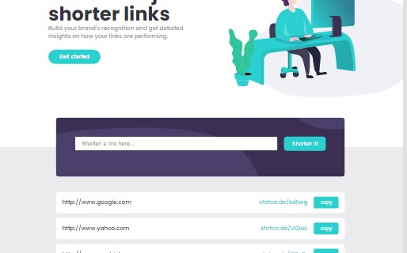

# Frontend Mentor - Shortly URL shortening API Challenge solution

## Table of contents

- [Overview](#overview)
  - [Screenshot](#screenshot)
  - [Links](#links)
- [My process](#my-process)
  - [Built with](#built-with)
- [Author](#author)

## Overview

### Screenshot

### Links

- Solution URL: [Add solution URL here](https://your-solution-url.com)
- Live Site URL: [Add live site URL here](https://your-live-site-url.com)

## My process

### Built with

- Scss
- Flexbox
- Redux
- laptop-first workflow
- [React](https://reactjs.org/) - JS library

## Author

- Frontend Mentor - [@ejim11](https://www.frontendmentor.io/profile/@ejim11)
- Twitter - [@favourejim56](https://www.twitter.com/@favourejim56)
